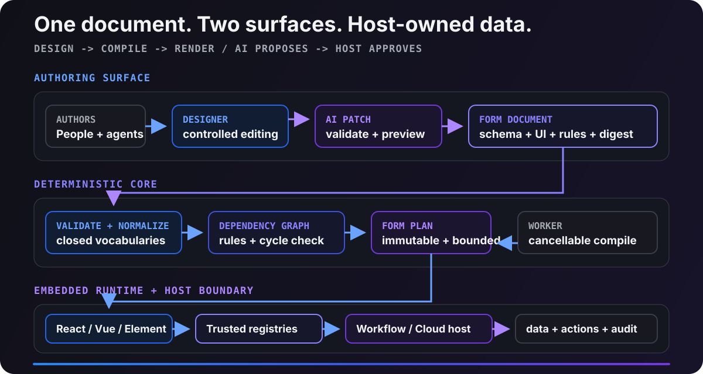

<p align="center">
  
</p>

<p align="center">
  
  
  
  <a href="LICENSE"></a>
</p>

<p align="center">
  <strong>一次定义，到处渲染；AI 可以提出修改，但不能绕过审阅。</strong><br>
  面向 A3S Workflow、A3S Cloud、业务产品和 Coding Agent 的可嵌入 AI Native Form Designer。
</p>

<p align="center">
  <a href="#quick-start">一键体验</a> ·
  <a href="#capabilities">能力</a> ·
  <a href="#architecture">架构</a> ·
  <a href="#embedding">嵌入</a> ·
  <a href="#agent">Coding Agent</a> ·
  <a href="#quality">质量</a>
</p>

> [!NOTE]
> 当前仓库提供可运行的 **v0.1.0 源码与工作区包**：中文 Designer、受控 Renderer、确定性 Compiler、React/Vue/Web Component 适配、Workflow/Cloud 契约、CLI 与 `$a3s-form` Skill 均已落地。发布到包注册表前，请通过源码或 workspace dependency 集成。

<a id="quick-start"></a>

## 一键体验

准备好 Git 与 Bun 即可；Windows 首次可运行 `winget install --id Oven-sh.Bun --exact`，macOS/Linux 脚本会在缺少 Bun 时调用官方安装器。部署入口会锁定依赖、构建包和中文体验站，并在 `http://127.0.0.1:4176` 启动本地服务。

**Windows PowerShell**

```powershell
git clone https://github.com/A3S-Lab/Form.git
Set-Location Form
powershell -NoProfile -ExecutionPolicy Bypass -File .\scripts\deploy.ps1
```

Windows 服务通过隐藏进程启动，不会弹出 cmd 窗口。停止服务：

```powershell
powershell -NoProfile -ExecutionPolicy Bypass -File .\scripts\stop.ps1
```

**macOS / Linux**

```bash
git clone https://github.com/A3S-Lab/Form.git
cd Form
./scripts/install.sh
```

停止服务：

```bash
./scripts/stop.sh
```

使用 `-NoStart`（Windows）或 `--no-start`（macOS/Linux）可以只完成依赖安装和构建；`-Port 4200` / `--port 4200` 可以切换端口。该服务用于本地体验和嵌入调试，生产托管应接入宿主已有的静态资源与鉴权设施。

<a id="capabilities"></a>

## 一个表单契约，四个产品面

普通 schema renderer 只能画输入框。A3S Form 让设计、预览、运行时和 Agent 修改共享相同语义，并明确谁拥有业务数据与副作用。

| 产品面 | 已实现能力 |
| --- | --- |
| **Form Designer** | A3S Office 组件样式、中文字段库、结构树、栅格/分栏/标签页/折叠布局、跨容器拖放、自定义节点、实时预览、撤销/重做与编译诊断 |
| **Form Renderer** | 受控值、字段校验、显隐/启用规则、数据源选项、动作回调、只读与外部错误、自定义节点与重复项 |
| **Form Compiler** | 输入边界、语义校验、依赖环检测、能力检查、canonical SHA-256、不可变 `FormPlan`、可取消 Worker |
| **Agent Interface** | JSON CLI、revision-bound `FormPatch`、`$a3s-form` Skill、机器可读诊断和原子修改 |

核心不变量：

- `FormDocument` 是 schema、UI、规则、引用、revision 和 digest 的唯一事实源。
- Designer 与 Renderer 都消费同一个编译器产生的 `FormPlan`。
- AI 只提交有界补丁；revision 冲突会失败，不会覆盖更新的人工作业。
- 组件只发出值与动作；持久化、身份、授权、密钥和副作用属于宿主。
- 文档不执行任意 JavaScript；widget、data source、action 只解析宿主允许的 registry key。

### React 最小嵌入

```tsx
import { assertCompiled } from '@a3s-lab/form/core';
import { FormDesigner, FormRenderer } from '@a3s-lab/form/react';
import '@a3s-lab/form/styles.css';

const plan = assertCompiled(document);

<FormDesigner document={document} onChange={setDocument} />

<FormRenderer
  plan={plan}
  value={value}
  onChange={setValue}
  onAction={handleAction}
/>
```

<a id="architecture"></a>

## 架构

<p align="center">
  
</p>

```text
                 人工作者                     Coding Agent
                    │                    CLI / $a3s-form Skill
                    └──────────┬───────────────┘
                               │ FormPatch（校验 + 审阅）
                               ▼
                    ┌──────────────────────┐
     中文 Designer ◄┤ canonical FormDocument├► revision + SHA-256
                    └──────────┬───────────┘
                               │
                               ▼
                    确定性 Compiler / Worker
                               │ immutable FormPlan
                  ┌────────────┼─────────────┐
                  ▼            ▼             ▼
               React         Vue 3      Web Component
                  └────────────┼─────────────┘
                               │ controlled value / action
                  ┌────────────┴─────────────────────────┐
                  ▼                                      ▼
       A3S Workflow（FormRef / durable run）   A3S Cloud（tenant / auth / data）
```

`FormDocument` 包含：

```text
schema          受支持的 JSON Schema 2020-12 子集
ui              节点、布局、widget key、提示与选项
rules           visible / enabled / computed / validate 纯表达式
dataSources     宿主解析的声明式数据请求
actions         宿主解析的声明式动作
metadata        标题、语言、所有权与兼容信息
revision        乐观版本
digest          canonical SHA-256
```

完整设计见 [架构说明](docs/architecture.md) 与 [安全边界](docs/security.md)。

<a id="embedding"></a>

## 为 A3S Cloud 与 Workflow 而生的嵌入边界

| 集成 | 契约 |
| --- | --- |
| **A3S Cloud** | `createA3SCloudFormAdapter` 注入 organization/project/environment 上下文、数据源和动作；Cloud 继续拥有权限、存储、密钥和审计 |
| **Workflow 节点配置** | 节点只固定 `FormRef { uri, revision, digest, mode: configuration }` 与校验后的配置值 |
| **耐久人工交互** | 运行发出 `interaction` FormRef 并暂停；提交匹配原 revision/digest、通过 schema 后才能恢复运行 |
| **A3S Code agentic 节点** | Agent 可以请求受治理表单交互，但不获得开放浏览器、生产凭据或无界动作通道 |

表单升级不会静默改变已发布工作流。已开始的运行始终按最初固定的 digest 校验。Core compiler 无数据库和网络依赖，可在 Worker、本地进程或宿主隔离 Runtime 中作为无状态任务独立扩缩容。

支持的导出：

| Export | 用途 |
| --- | --- |
| `@a3s-lab/form/core` | 文档、编译、校验、补丁、模板和 headless state |
| `@a3s-lab/form/react` | React Designer 与 Renderer |
| `@a3s-lab/form/vue` | Vue 3 `v-model` adapter |
| `@a3s-lab/form/web-component` | `<a3s-form-designer>` / `<a3s-form-renderer>` |
| `@a3s-lab/form/cloud` | A3S Cloud host adapter |
| `@a3s-lab/form/workflow` | FormRef、交互请求与提交校验 |
| `@a3s-lab/form/compiler.worker.js` | 可取消浏览器编译 Worker |
| `@a3s-lab/form/styles.css` | 与 A3S Office 同源 token、控件密度和交互状态的共享样式 |

自定义节点注册、React/Vue/Web Component 与宿主适配示例见 [集成指南](docs/integration.md)。

<a id="agent"></a>

## Coding Agent CLI 与 Skill

构建后，`a3s-form` 的所有命令都输出 JSON，适合 Codex 等本地 Coding Agent 串联：

```bash
node dist/cli.js sample --output form.json --pretty
node dist/cli.js validate form.json --pretty
node dist/cli.js compile form.json --output plan.json --pretty
node dist/cli.js diff before.json after.json --output change.patch.json --pretty
node dist/cli.js patch form.json change.patch.json --output candidate.json --pretty
node dist/cli.js digest candidate.json
```

推荐 Agent 流程：

```text
validate current
  -> 生成绑定 baseRevision 的 FormPatch
  -> patch 到 candidate
  -> validate candidate
  -> diff 供人或宿主审阅
  -> 批准后替换并重新固定 digest
```

Skill 位于 [`skills/a3s-form`](skills/a3s-form/SKILL.md)。它要求 Agent 以 CLI 为语义权威，不通过抓取 UI 猜测文档，也不直接伪造 revision 或 digest。

<a id="quality"></a>

## 可验证的质量基线

当前全量运行时代码覆盖率：

| 指标 | 覆盖率 |
| --- | ---: |
| Statements | **99.22%** |
| Branches | **96.08%** |
| Functions | **99.01%** |
| Lines | **99.61%** |

- 93 项单元与跨框架集成测试全部通过。
- A3S Test 在本地使用无头浏览器完成 Designer → Preview → validation → action 的 27 步端到端验收。
- A3S Test 面向本地 Coding Agent 使用，不接入 CI，也不上传截图、视频或证据。
- CI 只执行锁定依赖、lint、类型检查、覆盖率门禁、包/CLI 构建和 Playground 构建。

```bash
bun run check
```

## 仓库结构

```text
apps/playground/           中文可运行体验站
src/core/                  文档、编译器、补丁、表达式与状态
src/react/                 Designer 与 Renderer
src/adapters/              A3S Cloud host adapter
src/integrations/          A3S Workflow FormRef 与交互契约
src/workers/               可取消编译 Worker/client
skills/a3s-form/           Coding Agent Skill
scripts/deploy.ps1         Windows 一键构建与隐藏部署
scripts/install.sh         macOS/Linux 一键构建与部署
tests/                     单元、集成和本地 A3S Test ACL
docs/                      架构、集成与安全说明
```

## 许可证

A3S Form 使用 [MIT License](LICENSE)。
